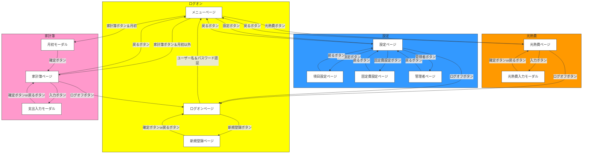

```mermaid

graph TD

    classDef default fill: #fff,stroke: #333,stroke-width: 1px;
    style funcA fill: #ff0,stroke: #333,stroke-width: 1px;
    style funcB fill: #f9c,stroke: #333,stroke-width: 1px;
    style funcC fill: #f90,stroke: #333,stroke-width: 1px;
    style funcD fill: #39f,stroke: #333,stroke-width: 1px;

    メニューページ--家計簿ボタン＆月初-->月初モーダル
    メニューページ--家計簿ボタン＆月初以外-->家計簿ページ
    家計簿ページ--戻るボタン-->メニューページ
    家計簿ページ--ログオフボタン-->ログオンページ

    メニューページ--光熱費ボタン-->光熱費ページ
    光熱費ページ--戻るボタン-->メニューページ
    光熱費ページ--ログオフボタン-->ログオンページ

    メニューページ--設定ボタン-->設定ページ
    設定ページ--戻るボタン-->メニューページ
    設定ページ--ログオフボタン-->ログオンページ

    subgraph funcA [ログオン]
    ログオンページ--ユーザー名＆パスワード認証-->メニューページ
    ログオンページ--新規登録ボタン-->新規登録ページ
    新規登録ページ--確定ボタンor戻るボタン-->ログオンページ
    end

    subgraph funcB [家計簿]
        月初モーダル--確定ボタン-->家計簿ページ
        家計簿ページ--入力ボタン-->支出入力モーダル
        支出入力モーダル--確定ボタンor戻るボタン-->家計簿ページ
    end

    subgraph funcC [光熱費]
        光熱費ページ--入力ボタン-->光熱費入力モーダル
        光熱費入力モーダル--確定ボタンor戻るボタン-->光熱費ページ
    end

    subgraph funcD [設定]
        設定ページ--項目設定ボタン-->項目設定ページ--戻るボタン-->設定ページ
        設定ページ--固定費設定ボタン-->固定費設定ページ--戻るボタン-->設定ページ
        設定ページ--管理者ボタン-->管理者ページ--戻るボタン-->設定ページ
    end
```